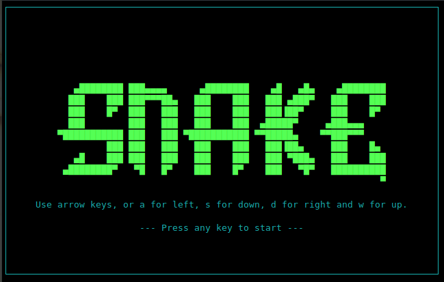

                                 /^\/^\
                               _|__|  O|
                      \/     /~     \_/ \
                       \____|__________/  \
                             \_______      \
                                     `\     \                    \
                                      |     |                     \
     ____              _             /     /                       \
    / ___| _ __   __ _| | _____     /     /                         \\
    \___ \| '_ \ / _` | |/ / _ \   /     /                           \ \
     ___) | | | | (_| |   <  __/  /     /                             \  \
    |____/|_| |_|\__,_|_|\_\___| /     /             _----_            \   \
                                /     /           _-~      ~-_         |   |
                               (      (        _-~    _--_    ~-_     _/   |
                                \      ~-____-~    _-~    ~-_    ~-_-~    /
                                  ~-_           _-~          ~-_       _-~   - jurcy -
                                     ~--______-~                ~-___-~

Symfony bundle for `dbu/php-snake`, the command line snake game.

This repository provides the bundle to install in a Symfony application. If you just want the game stand-alone, look at
the [php-snake](https://github.com/dbu/php-snake) repository.

# Installation and Usage

## Installation

In your Symfony application, run:

    composer require dbu/snake-bundle

## Run

    bin/console game:snake

## Development

Clone the git repository, then run:

    composer install
    ./tests/fixtures/app/bin/console game:snake

# FAQ

## My console is looking weird after running the command

This can happen after aborting the program, e.g. with <ctrl>-c. Reset the console to sane defaults
by typing:

    stty sane

Be aware that input is probably hidden, so you won't see anything until you hit enter.

## Why Snake?

Because it was the first thing I could think of. 
And its simple enough that it should be possible to follow what is going on.

## What is this font?

Delta Corps Priest 1 from http://patorjk.com/software/taag/

# Screenshots

